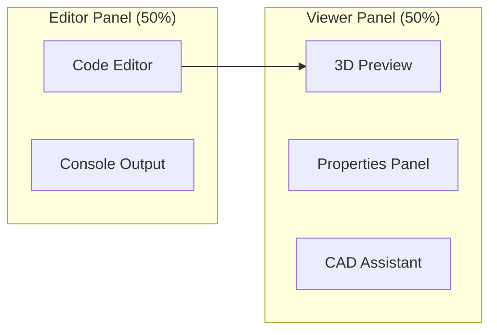
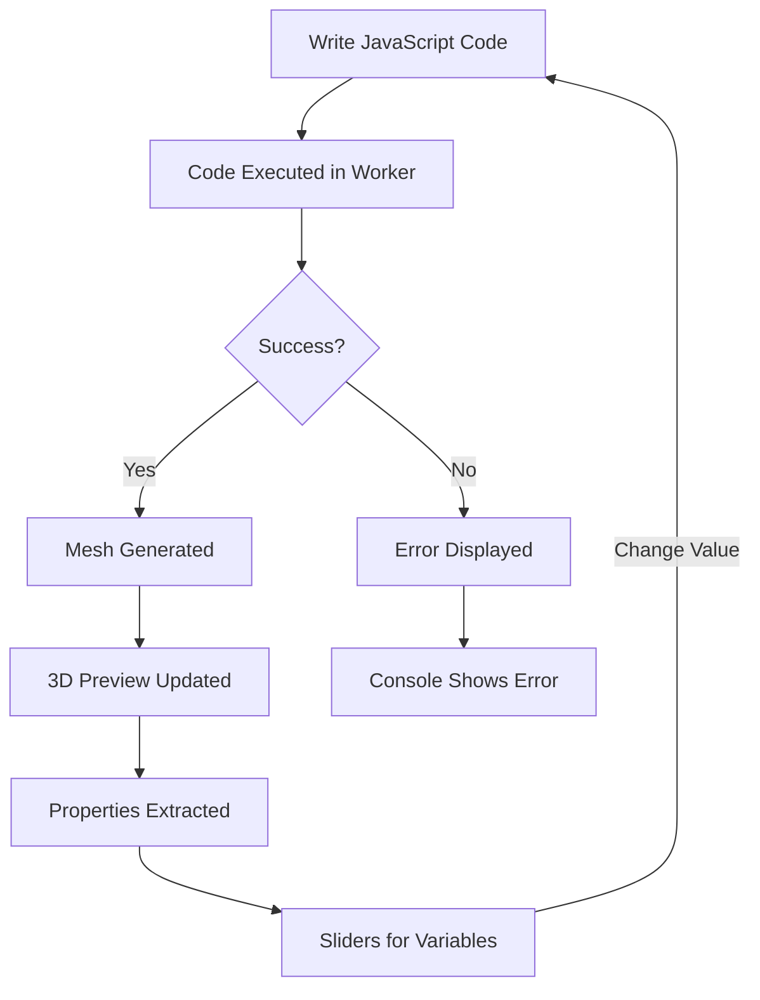
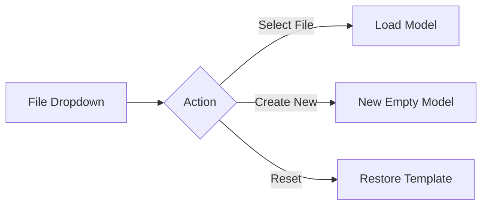
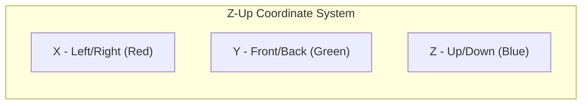
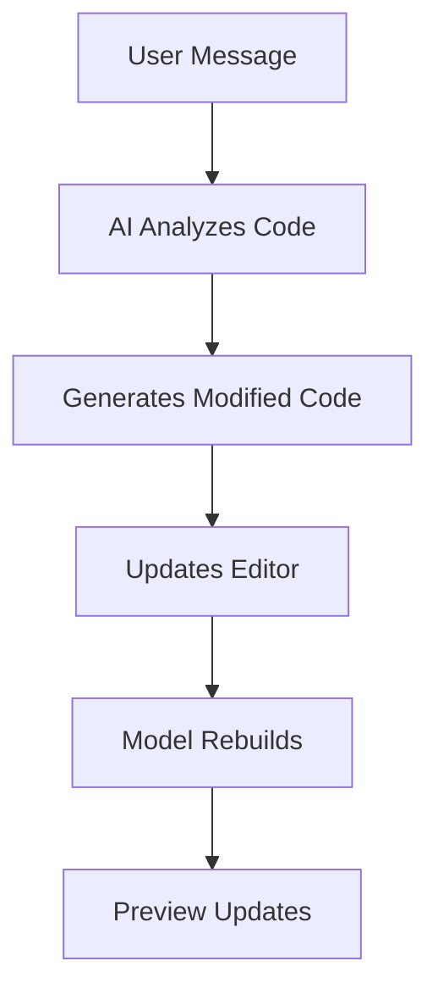
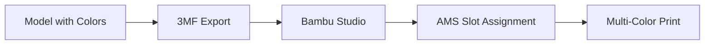

# DAZ-CAD-2 User Guide

A complete guide to using the DAZ-CAD-2 browser-based parametric CAD editor.

## Table of Contents

- [Getting Started](#getting-started)
- [Interface Overview](#interface-overview)
- [Editor Panel](#editor-panel)
- [3D Viewer](#3d-viewer)
- [Properties Panel](#properties-panel)
- [CAD Assistant](#cad-assistant)
- [Exporting Models](#exporting-models)
- [Working with Gridfinity](#working-with-gridfinity)
- [Keyboard Shortcuts](#keyboard-shortcuts)

---

## Getting Started

### Starting the Server

```bash
./run serve
```

The server starts at `http://127.0.0.1:8765`. Open this URL in your browser.

### URL-Based Model Selection

You can navigate directly to a model using its name in the URL:

- `http://127.0.0.1:8765/gridfinity-demo` - Opens the gridfinity demo model
- `http://127.0.0.1:8765/open-box` - Opens the open box model

---

## Interface Overview

The interface is divided into two main panels:



### Component Flow



---

## Editor Panel

### File Selector

Click the filename dropdown in the header to:

- **Switch between models** - Click any file in the list
- **Create new models** - Type a name and click "Create"
- **Reset to template** - Click the reset button (curved arrow) to restore the original template file



### Code Editor Features

The Monaco-based code editor provides:

- **Syntax highlighting** for JavaScript
- **Auto-completion** for CAD library methods
- **Type hints** showing method signatures
- **Error highlighting** for syntax errors

### Auto-Save and Live Preview

Your code is automatically saved as you type. After a brief pause (300ms), the model rebuilds automatically.

### Console Output

The console shows:
- Build progress and timing
- Debug messages from your code
- Error details with stack traces

Click **Clear** to empty the console.

---

## 3D Viewer

### Navigation Controls

| Action | Control |
|--------|---------|
| Rotate | Left-click + drag |
| Pan | Right-click + drag (or Shift + left-click) |
| Zoom | Scroll wheel |

### Opacity Control

Use the **Opacity** slider in the viewer header to adjust model transparency (10-100%). This is useful for:
- Seeing internal features
- Debugging boolean operations
- Visualizing hollow sections

### View Reset

The camera automatically fits to show the entire model when:
- A new model is loaded
- You haven't manually adjusted the view

Once you interact with the view, it preserves your camera position through code changes.

### Coordinate System

DAZ-CAD-2 uses a CAD-standard coordinate system:



- **Grid**: 250mm x 250mm build volume at Z=0
- **Grid spacing**: 10mm per division
- **Origin**: Center of the grid

---

## Properties Panel

The Properties panel automatically detects numeric variables in your code and creates sliders for them.

### How It Works

```mermaid
sequenceDiagram
    participant Editor
    participant Parser
    participant Properties
    participant Preview

    Editor->>Parser: Code changes
    Parser->>Parser: Find const/let declarations
    Parser->>Properties: Extract numeric values
    Properties->>Properties: Create sliders
    Properties->>Editor: Update on slider change
    Editor->>Preview: Rebuild model
```

### Detected Patterns

The parser recognizes these patterns:

```javascript
const LENGTH = 80;        // Detected as "LENGTH"
let width = 40;           // Detected as "width"
const WALL_HEIGHT = 40;   // Detected as "WALL_HEIGHT"
```

### Using Sliders

1. **Drag the slider** to change the value
2. **Click the value** to type a specific number
3. Changes are applied immediately

### Slider Ranges

Ranges are automatically calculated:
- Minimum: Current value / 2
- Maximum: Current value * 2
- Step: Intelligent stepping based on value magnitude

---

## CAD Assistant

The built-in AI assistant can help modify your models through natural language.

### How to Use

1. Type a request in the chat input
2. Press Enter or click Send
3. The assistant will modify your code

### Example Requests

- "Make the walls thicker"
- "Add a hole in the center"
- "Change the color to blue"
- "Double the height"

### Workflow



---

## Exporting Models

### STL Export

Click the **STL** button to download a standard STL file. Compatible with any slicer software.

### 3MF Export (Recommended for Bambu Lab)

Click the **3MF** button to download a Bambu Studio-compatible 3MF file with:

- **Multi-color support** - Colors are preserved and mapped to AMS slots
- **Modifier volumes** - For multi-material printing
- **Infill settings** - Per-object infill density and pattern



### Metadata for 3MF

Set print settings directly in code:

```javascript
const part = new Workplane("XY")
    .box(50, 50, 20)
    .infillDensity(5)       // 5% infill
    .infillPattern('gyroid')  // Gyroid pattern
    .color('#3498db');        // Blue color
```

---

## Working with Gridfinity

DAZ-CAD-2 includes built-in support for creating Gridfinity-compatible bins and inserts.

### Creating a Basic Bin

```javascript
// Create a 2x2 gridfinity bin, 3 units tall
const bin = Gridfinity.bin({ x: 2, y: 2, z: 3 });
```

### Adding Cutouts

```javascript
// Rectangular cutout grid
const bin = Gridfinity.bin({ x: 2, y: 2, z: 3 })
    .cutRectGrid({
        width: 30,       // Cutout width in mm
        height: 30,      // Cutout height in mm
        fillet: 3,       // Corner radius
        minBorder: 2     // Shell thickness
    });

// Circular cutout grid
const bin = Gridfinity.bin({ x: 2, y: 2, z: 3 })
    .cutCircleGrid({
        diameter: 25,    // Hole diameter in mm
        minSpacing: 2    // Space between holes
    });
```

### Auto-Fitting Custom Cuts

Let the system find the smallest bin that fits your cutouts:

```javascript
const bin = Gridfinity.fitBin({
    cuts: [
        [80, 40],           // 80x40mm rectangle
        [30, 20],           // 30x20mm rectangle
        { width: 35, height: 20, fillet: 5 }  // Custom fillet
    ],
    z: 3,                   // Height in units
    spacing: 1.5            // Gap between cuts
});
```

### Gridfinity Constants

| Constant | Value | Description |
|----------|-------|-------------|
| UNIT_SIZE | 42mm | Grid unit width/depth |
| UNIT_HEIGHT | 7mm | Height per z-unit |
| BASE_HEIGHT | 4.75mm | Stepped base profile |
| WALL_THICKNESS | 1.2mm | Default wall thickness |

---

## Keyboard Shortcuts

| Shortcut | Action |
|----------|--------|
| Ctrl+S / Cmd+S | Save (auto-saves anyway) |
| Ctrl+Z / Cmd+Z | Undo |
| Ctrl+Shift+Z / Cmd+Shift+Z | Redo |
| Ctrl+/ / Cmd+/ | Toggle comment |
| Ctrl+Space | Trigger autocomplete |

---

## Tips and Best Practices

### Performance

1. **Use patterns last** - Apply `cutPattern()` after `chamfer()`/`fillet()` to avoid processing thousands of edges
2. **Minimize boolean operations** - Each `union()`/`cut()` is expensive
3. **Use the Profiler** - Measure build times to optimize

```javascript
const profile = new Profiler('My Build');
// ... operations ...
profile.checkpoint('step 1');
// ... more operations ...
profile.finished();
```

### Debugging

1. **Check the console** - All operations log their progress
2. **Use opacity slider** - See inside hollow objects
3. **Color different parts** - Distinguish components during development

### Code Organization

1. **Put configuration at the top** - Easy to find and modify
2. **Name your parts** - Use `.partName('description')` for 3MF
3. **Comment complex operations** - Future you will thank you

---

## Next Steps

- See the [Library Reference](./library-reference.md) for complete API documentation
- Check out the example models in the file selector
- Experiment with different Gridfinity configurations
